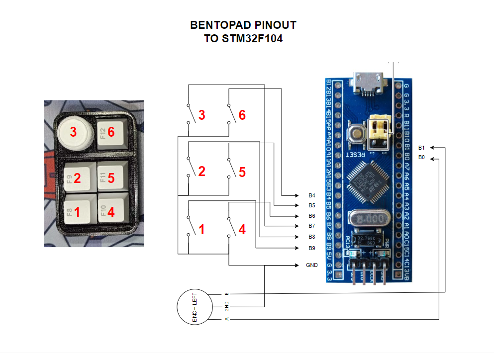
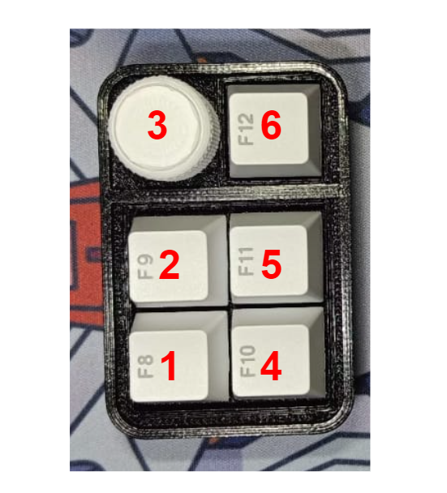

# BentoPad-QMK-VIA

## Spesification
- STMf103 type C as Microcontroller
- QMK Firmware
- Support VIA, all key and knob can proggrammed
- Hotswap Switch
- 1x Encoder Knob
- 3D Case 


## Auto Detect VIA
this Device can automatically detect on VIA, just need PC with Intercet Connection
- Connect your macropad to PC
- Open VIA
- It will auto detect

## Load JSON File
or you can load manually json file like a library for detect this macropad
- Connect your macropad to PC
- Open VIA
- In Tab Setting, enable "Show Design Tab"
- Open Design Tab
- Load file with name "zeapad_via_definitions.json" 
- Open Configure Tab to setting your macropad
- If nothing happend , do it again from first 

## Cara Setting Knob
- Untuk melakukan setting di knob perlu memasukan command berupa keycode qmk, Jadi cara nya sama dengan melakuykan setting dengan Any key seperti petunjuk pada link berikut: 
https://docs.keeb.io/via

Here's some examples:

- LALT(KC_TAB) - Sends Alt-Tab
- LCTL(KC_C) - Sends Ctrl-C
- LGUI(KC_C) - Sends Cmd-C or Win-C
- LSFT(LCTL(KC_END)) - Sends Shift-Ctrl-End
- MO(1) - Momentarily turn on layer 1
- LCA(KC_DEL) - Sends Ctrl-Alt-Del
- MT(MOD_RSFT, KC_ENT) - Sends Shift if held, Enter if tapped
- MACRO (0) - macro 0

## Link Keycode QMK
- mouse : https://github.com/qmk/qmk_firmware/blob/master/docs/feature_mouse_keys.md
- keyboard : https://github.com/qmk/qmk_firmware/blob/master/docs/keycodes.md

## Tutorial VIA Usage
- https://docs.keeb.io/via

## Download VIA
Link Download VIA(Pilih sesuai OS) : https://github.com/the-via/releases/releases
VIA WEB VERSION : https://usevia.app/

## Pinout Wiring 
<p align="center">
  
</p>

## Preview VIA

https://github.com/juarendra/Lianumpad-QMK-VIA/assets/43043633/daf05cb3-5ffb-4896-910a-576f78afdfc5


## HOW To FLASH MACROPAD
### USING QMK TOOLBOX
- Prepare the macropad, USB cable and firmware that you want to update/upgrade to your macropad
- Download QMK Toolbox Software at [following link](https://github.com/qmk/qmk_toolbox/releases)
- Install QMK Toolbox Software, Install All the drivers. After ready you can load the previous Firmware. Then Check Auto-Flash as shown below
<p align="center">
  
</p>

- Plug the USB Type C cable into the macropad without plugging it into your PC USB first
- Press and hold button no. 1 as shown in the picture. then plug the previous USB end into your PC USB while still holding the previous button for a moment
- After there is a sound/notification that the USB has entered. you can release the knob button
<p align="center">
  
</p>

- Then the macropad will automatically flash. you can watch the following video for more help
[link VIDEO](https://github.com/juarendra/BentoPad-QMK-VIA/blob/main/DOC/WhatsApp%20Video%202024-08-30%20at%2021.38.20.mp4)

### USING QMK MYSYS
- Download QMK MYSYS, Install and setup QMK MYSYS, you can see this [tutorial](https://msys.qmk.fm/guide.html#next-steps)
- After all setup in QMK MYSYS, copy this [folder firmware(bento_stm32_auto)](https://github.com/juarendra/BentoPad-QMK-VIA/tree/main/Firmware) to folder qmk_firmware/keyboards/
- Open QMK MYSYS
- Then enter this command, to enter qmk folder
```sh
cd qmk_firmware/
```
- Then enter this comman, to compile and enter mode flash qmk
```sh
qmk flash -kb bento_stm32_auto -km via
```
- After compile finish you can see instructions to connect macropad like this
```sh
Bootloader not found. Make sure the board is in bootloader mode. See https://docs.qmk.fm/#/newbs_flashing
 Trying again every 0.5s (Ctrl+C to cancel).............................
```
- Connect USB macropad, then macropad will be to flashed.
- Reconnect USB macropad, PC will be detected macropad
- You can see this [VIDEO](https://github.com/juarendra/STREAMPAD-QMK-VIA/blob/main/DOC/tutorial_flash.mp4) for helping 